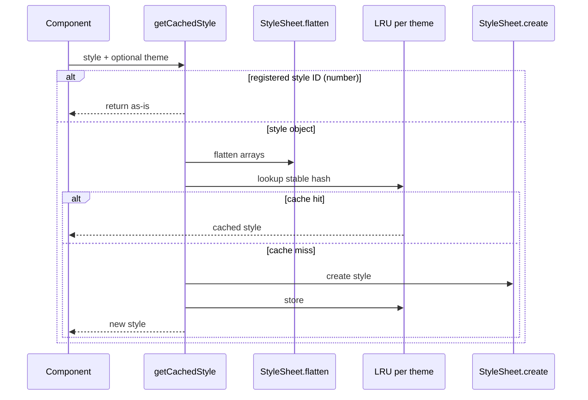

<p align="center">
  
</p>

<h1 align="center">medhira-rn-styles-cache</h1>

<p align="center">
  <strong>LRU-backed caching for dynamic React Native styles</strong>
</p>

<p align="center">
  <a href="https://www.npmjs.com/package/medhira-rn-styles-cache"></a>
  <a href="https://www.npmjs.com/package/medhira-rn-styles-cache"></a>
  <a href="https://opensource.org/licenses/MIT"></a>
  <a href="https://medhira-rn-styles-cache.readthedocs.io"></a>
</p>

<p align="center">
  Engineering Intelligence Across Everything — by <a href="https://medhira.readthedocs.io/en/latest/">MEDHIRA</a>
</p>

---

## Why this exists

`StyleSheet.create()` optimizes style objects, but **dynamic styles** recreated every render waste work and memory. This package caches flattened styles in an **LRU cache** keyed by a stable hash, so identical style shapes reuse the same registered style reference.

| You get | Details |
|--------|---------|
| LRU caching | Configurable max entries (default **500**) |
| Stable keys | Canonical serialization — property order does not matter |
| Theme keys | Separate LRU buckets per theme string |
| RN-native flattening | Uses `StyleSheet.flatten` for arrays and nested styles |

## Install

```sh
# Expo
npx expo install medhira-rn-styles-cache

# React Native
npm install medhira-rn-styles-cache
```

**Peer dependencies:** `react`, `react-native` (tested with RN 0.85.x, React 19.x)

## Quick start

```tsx
import { View } from 'react-native';
import { getCachedStyle } from 'medhira-rn-styles-cache';

const dynamicStyle = getCachedStyle({
  width: isWide ? 200 : 100,
  padding: 12,
});

export function Card() {
  return <View style={dynamicStyle} />;
}
```

## How it works



Full architecture: [docs/architecture.md](https://medhira-rn-styles-cache.readthedocs.io/en/latest/architecture/)

## API

| Function | Description |
|----------|-------------|
| `getCachedStyle(style, theme?)` | Cache one style |
| `getCachedStyles(map, theme?)` | Cache a named map of styles |
| `prewarmStyles(styles, theme?)` | Fill cache at startup |
| `clearStyleCache(theme?)` | Clear all themes, or one theme |
| `configureStyleCache({ max })` | Set LRU max size |
| `getStyleCacheStats()` | `{ size, max, themes }` |

```tsx
import {
  configureStyleCache,
  getCachedStyle,
  getCachedStyles,
  prewarmStyles,
  clearStyleCache,
} from 'medhira-rn-styles-cache';

configureStyleCache({ max: 1000 });

const light = getCachedStyle({ color: '#000' }, 'light');
const styles = getCachedStyles({ row: { flexDirection: 'row' } }, 'light');

prewarmStyles([{ flex: 1 }, { padding: 8 }]);
clearStyleCache('light');
```

Platform-specific styles: use standard spread — `...Platform.select({ ios: {...}, android: {...} })` inside your style object before passing it to `getCachedStyle`.

See the [API reference](https://medhira-rn-styles-cache.readthedocs.io/en/latest/api/) and [examples](https://medhira-rn-styles-cache.readthedocs.io/en/latest/examples/).

## When to use

| Use this library | Prefer module-level `StyleSheet.create` |
|------------------|----------------------------------------|
| Styles depend on props/state | Styles are fully static |
| Shared dynamic tokens (theme, density) | One-time app shell styles |

## Contributing

Contributions are welcome. See [CONTRIBUTING.md](./CONTRIBUTING.md).

## Support

- [GitHub Issues](https://github.com/HELLOMEDHIRA/medhira-rn-styles-cache/issues)
- [hello.medhira@gmail.com](mailto:hello.medhira@gmail.com)
- [Documentation](https://medhira-rn-styles-cache.readthedocs.io)

## License

[MIT](./LICENSE) © MEDHIRA
