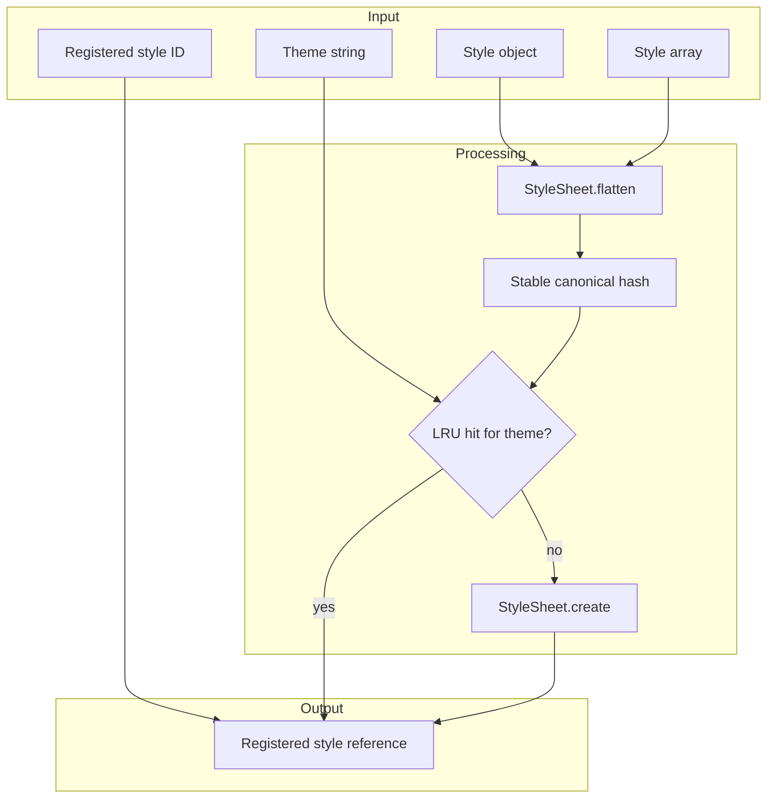
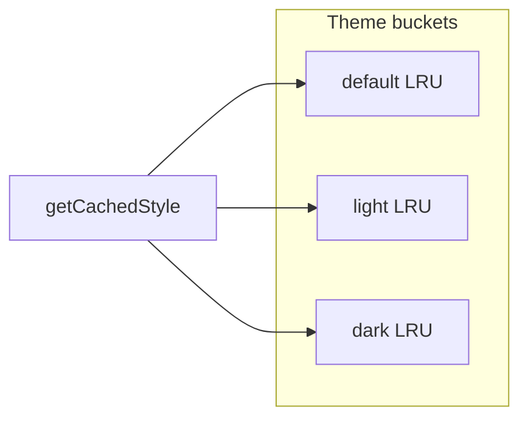
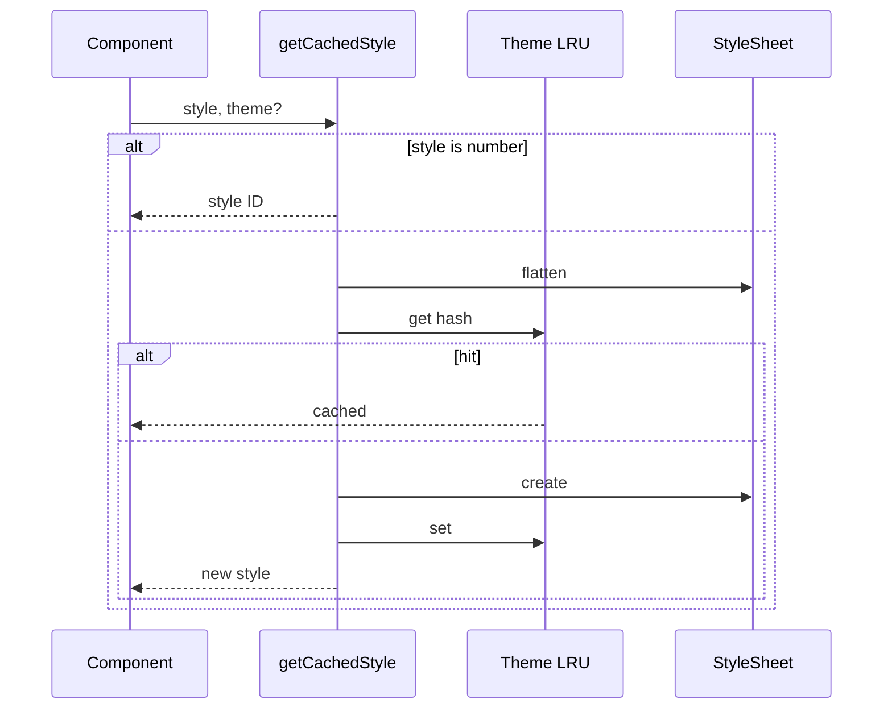

# Architecture

This page describes **behavior** of the public API. Implementation details may change between releases.

## Overview



## Cache layers

Each **theme** string gets its own LRU cache instance. The default theme is `"default"`. The same style object cached under `"light"` and `"dark"` produces two entries.



## Stable hashing

Cache keys are SHA-256 hashes of a **canonical JSON** representation of the flattened style. Keys are sorted so `{ a: 1, b: 2 }` and `{ b: 2, a: 1 }` map to the same entry.

## Platform-specific styles

Use React Native’s normal spread pattern. The library does not require a special key format:

```tsx
import { Platform } from 'react-native';
import { getCachedStyle } from 'medhira-rn-styles-cache';

const style = getCachedStyle({
  ...Platform.select({
    ios: { marginTop: 20 },
    android: { marginTop: 10 },
  }),
  width: '100%',
});
```

## Memory and eviction

- Default **500** entries **per theme** bucket.
- When the limit is exceeded, the LRU evicts the least recently used entry.
- Call `configureStyleCache({ max: n })` to change the limit for existing and new buckets.
- Call `clearStyleCache()` or `clearStyleCache('themeName')` to free memory.

## What this library does not do

- It does not replace static `StyleSheet.create` at module scope for fixed styles.
- It does not prevent React re-renders; it reduces repeated `StyleSheet.create` work.
- It does not merge style arrays at runtime on the view — flattening is only for cache keying and creation.

## Sequence


